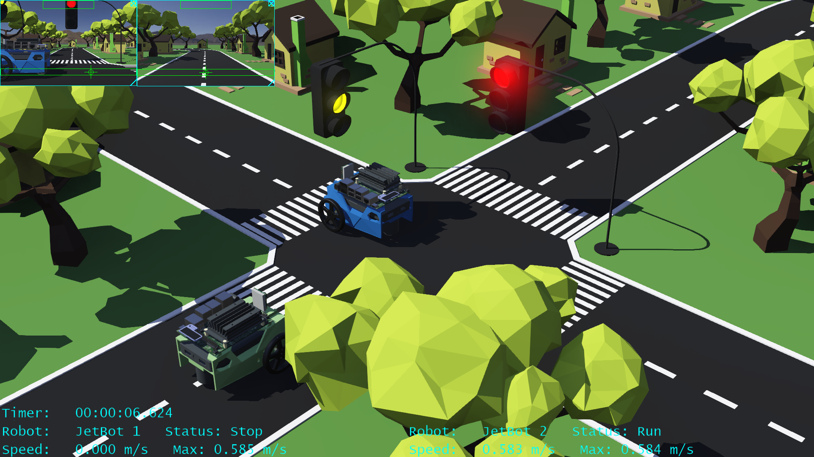
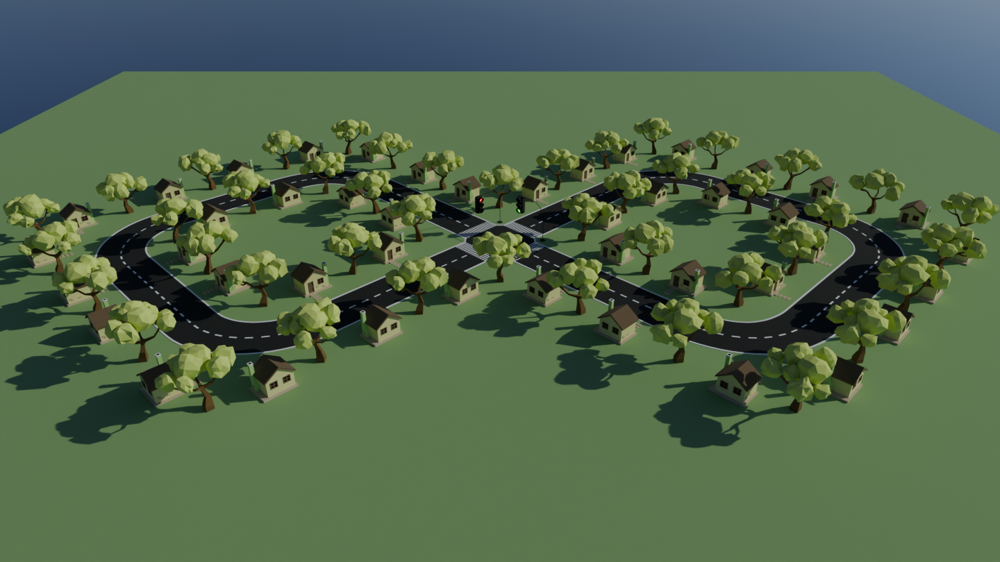
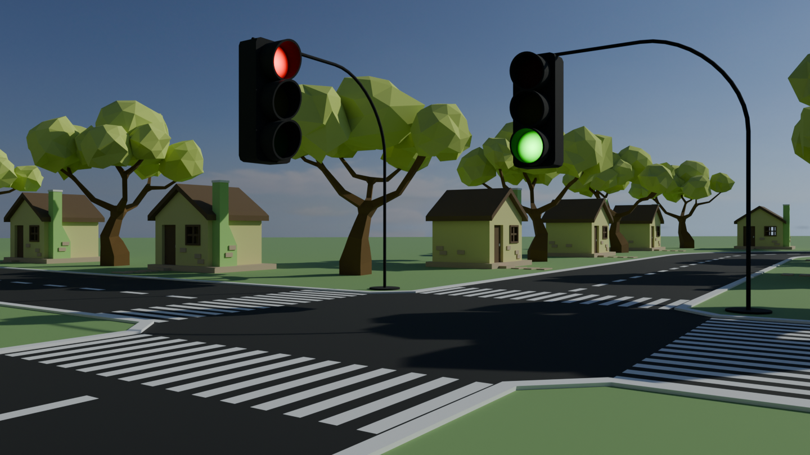
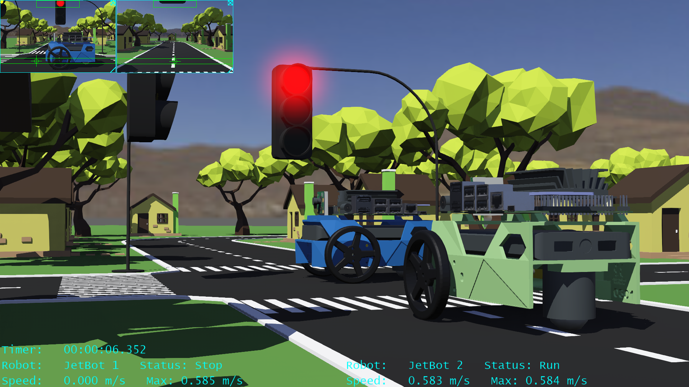
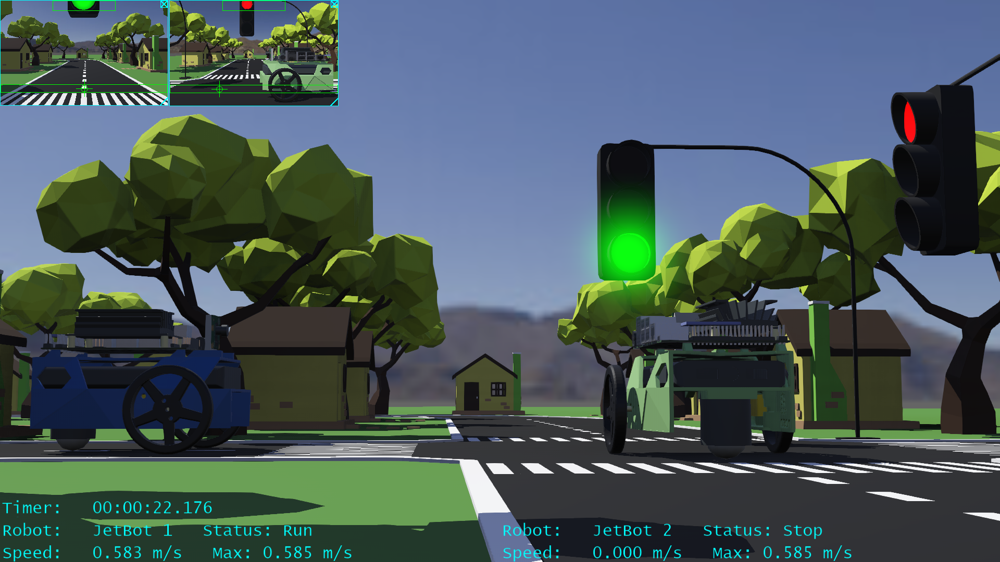
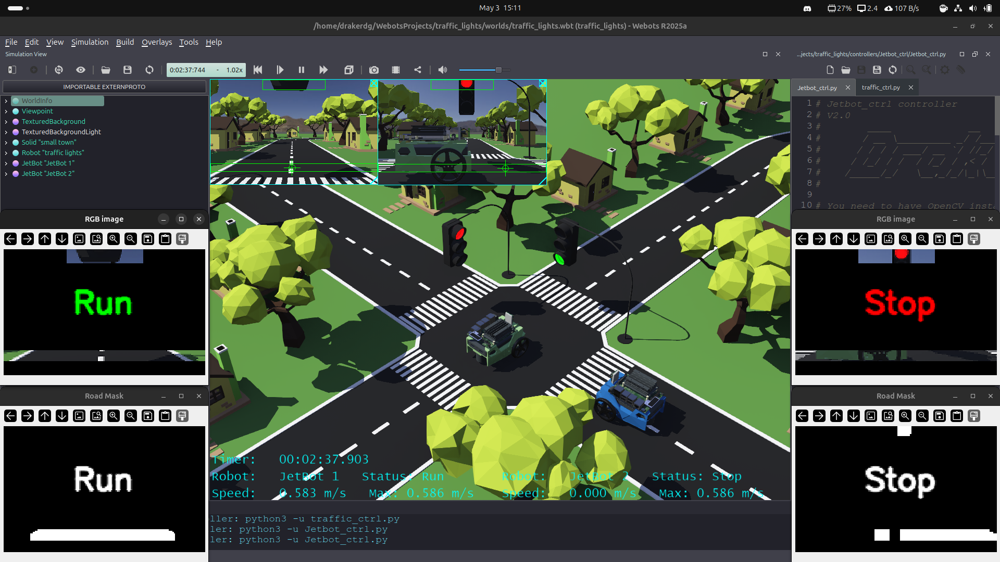
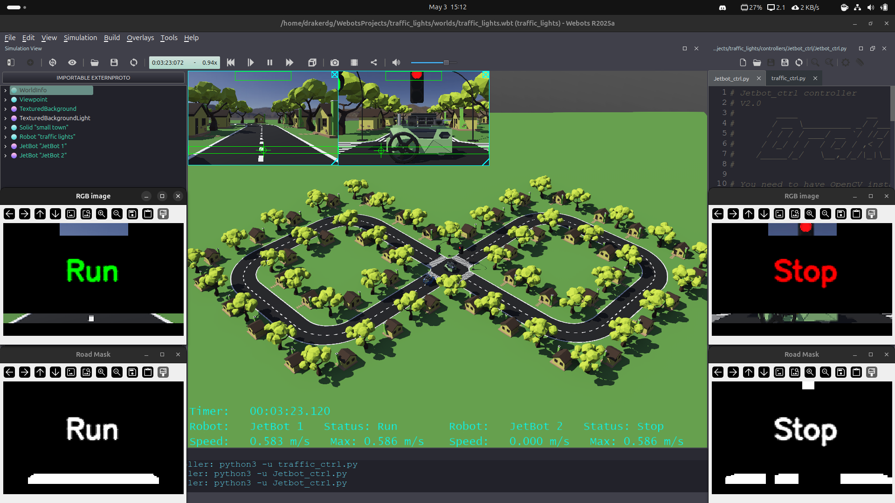

# Traffic lights - Driving simulation of 2 JetBot robots
 Webots – Python - OpenCV

---

## Project Overview

This project involves simulating two types of robots. The first robot controls and synchronizes two traffic lights using a Python controller. The second robot is a JetBot prototype used to represent two robots that can drive autonomously using the same Python controller, which includes the OpenCV and NumPy libraries. This robot uses a camera for navigation, processing each frame to determine the center of the road and thus follow its path. It can also detect red traffic lights and stop accordingly.



---

## Current Implementation Status

### Fully implemented features
- Sequential control and synchronization system for two traffic lights using FSM
- Navigation system using artificial vision, including road following and red light recognition for traffic lights

---

## 3D model design of the road

This project uses a low-poly model created in Blender that represents a small figure-eight road, containing an intersection with two traffic lights. I've added some houses and trees to enhance the model (small town).





## Webots World Structure

The simulation is based on a Webots world that features a small road within a small town.

At its center is an intersection controlled by a pair of traffic lights to prevent collisions between two JetBot robots.

### World Components

- **WorldInfo**
  Defines global simulation parameters such as time step, physics, and world behavior.

- **Viewpoint**
  Controls the main 3D camera parameters used for visualization.

- **TexturedBackground**
  Provides background textures and lighting conditions for the environment.

- **Small Town**
  Contains the ground that supports the simulation (solid) and the 3D models that make up the small town, including the road, traffic lights, houses and trees.


```
World
├── Small Town (Solid)
├── Traffic Lights (Robot)
├── JetBot 1 (Green Robot)
└── JetBot 2 (Blue Robot)
```

---

### Robots in the World

- **Traffic Lights**
  It is the robot that controls the operation of the traffic lights.

- **JetBot 1 & JetBot 2 Robots**
  These are two small robots, models (PROTOs) available from Webots and based on the real open-source robot based on NVIDIA Jetson Nano.
  The controller for these robots allows them to drive autonomously using artificial vision (OpenCV), recognizing the center of the road, as well as the red light of the traffic lights.

---

## ⚠️ Model & Physical Limitations

This robot does **not include distance sensors, nor a lidar sensor for navigation**.

### As a result:
- If solid objects are added to the road that are indistinguishable from the road (color and/or shape), a collision is possible.
- Something similar happens if the objects are outside the areas of interest for machine vision processing; they are practically invisible and can cause collisions.
- If the robots are moving at a considerable speed, they may not detect red traffic lights (just like in real life).

### For this reason, the controller applies:

- Speed limits
- Road free of objects or other robots during the journey, except for the intersection where the traffic lights are located.

The purpose of these limitations is to maintain functional behavior within the constraints of the robots..

---

## Performance Summary

```
├── Road length:           1.47 m
├── Radius of curves:      0.50 m
├── Average speed:         0.58 m/s
```

---

## Code controller files

```
├── traffic_ctrl.py           // Traffic light controller
├── Jetbot_ctrl.py            // JetBot robot controller
```

### Prerrequisites

The controllers are written in Python (fully commented), however the robot controller requires the installation of the OpenCV library as a prerequisite.

- Installing Python

1. Open the terminal (Ctrl + Alt + T) and update the list of available packages:

```
sudo apt update
```

2. Install Python 3 (the default version in most recent distributions):
```
sudo apt install python3
```

3. Verify the installation by typing:
```
python3 --version
```


- Installing OpenCV

1. Update the system:
```
sudo apt update
```

2. To instalin OpenCV library you can use pip to get the most up-to-date version, or apt for a stable version that's well integrated with the system.
   
pip option:
```
python3 -m pip install opencv-python
```
apt option:
```
sudo apt install python3-opencv
```

3. Verify the installation by typing:
```
python3 -c "import cv2; print(cv2.__version__)"
```

---

## How to Use

1. Clone the repository
2. Open the world in Webots
3. Run the simulation
4. Observe: synchronized operation of traffic lights → automatic driving of the two JetBot robots, as well as red light recognition to stop

```
git clone https://github.com/DrakerDG/Traffic-Lights.git
```

No manual tuning is required for basic operation.

---

## 💻 Hardware and software equipment used
```
- Host: Victus by HP Laptop 16-d0xxx
- CPU: 11th Gen Intel i7-11800H (16) @ 4.600GHz
- GPU: NVIDIA GeForce RTX 3060 Mobile / Max-Q
- Memory: 31727MiB 
- OS: Ubuntu 24.04.4 LTS x86_64
- Simulator: Webots
- 3D design: Blender
```
---

## Feedback & Contributions

Feedback is welcome in the following areas:
- Improvements to the control logic
- Enhancements and capabilities in visual AI processing
- Performance on different machines
- Improvements to the overall code structure
- Specific optimizations for Webots

Please refer to **CONTRIBUTING.md** before submitting changes.

---

## Screenshots & Visualization









---

## Project Intent

The primary goals of this repository are:
- Explore control strategies in simulation
- Study basic driving using artificial vision in an environment that can be reproduced with real robots
- Provide a reference implementation for experimentation and learning

This project is conceived as a support and complement to the JetBot robotic ecosystem, offering:
- A simulation-based environment that can be replicated in real robots
- Controllers written in Python using OpenCV and NumPy
- Reproducible experiments without risk of hardware failure

---

## Relationship to JetBot robot owner

- All credit for the robot concept belongs to the open-source JetBot real robot project and its contributors.
- This repository aims to add value through simulation, not ownership
- Improvements developed here are intended to be shared openly

Contributors are encouraged to respect the spirit of open collaboration and attribution.

---

## Philosophy

This repository prioritizes:
- Learning over optimization-at-all-costs
- Transparency over abstraction
- Stability and realism over raw speed

Any contribution should align with these principles.

## Final note
“If this work contributes to improving the understanding or development of simulation in Webots or the real use of robots with the use of artificial vision, it will have fulfilled its purpose.”

---

## External Sources

- **Blender**
  https://www.blender.org
  
- **Webots Simulator**
  https://cyberbotics.com

- **JetBot PROTO**
  https://cyberbotics.com/doc/guide/jetbot?version=R2021b#nvidia-jetbot

- **JetBot**
  https://jetbot.org/master

- **HSV reference**
  https://en.wikipedia.org/wiki/HSL_and_HSV

- **DrakeDG**
  https://x.com/draker_dg |  
  www.youtube.com/@DrakerDG

---

